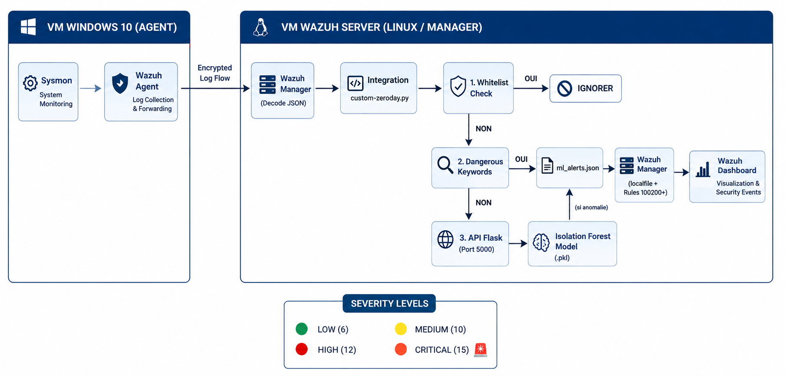
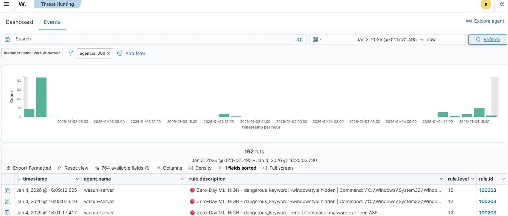

<h1 align="center">Zero-Day Attack Detection Model from SIEM Logs</h1>

  
  
  
  
  

---

## 📌 Project Overview

Traditional SIEM detection rules rely heavily on static signatures (e.g., known bad hashes, specific IP indicators). While effective against known threats, they fail completely to detect **Zero-Day attacks** or advanced evasion techniques.

This project addresses this critical gap by implementing an unsupervised **Machine Learning-driven Behavioral Detection Engine**. By extracting behavioral features from Windows **Sysmon logs (Event ID 1: Process Creation)**, the system trains an **Isolation Forest** model to establish a baseline of normal user activity and isolate anomalous process behaviors in real-time, effectively identifying **potential Zero-Day attacks** and advanced evasion techniques. Anomalies are dynamically scored and forwarded directly to a **Wazuh SIEM instance** for alerting and incident response.

**📄 Full Documentation:** [Download the Semester Project Report (PDF)](./rapport_PFS_ZERODAY.pdf)

---

## ⚙️ Detection Pipeline Architecture

The detection ecosystem operates as a continuous modular pipeline:

1.  **Log Collection & Sanitization:** Endpoints forward Windows Sysmon logs to a central collector. The engine isolates Event ID 1 logs, cleaning and standardizing the raw JSON data.
2.  **Feature Engineering & Vectorization:** Raw log fields are transformed into numerical metrics optimized for unsupervised learning (e.g., command line length, directory depth, token entropy, and specific execution flags).
3.  **Anomaly Detection (Isolation Forest):** The trained model evaluates the feature vectors, assigning an anomaly score based on how easily a data point can be isolated structurally from normal clusters.
4.  **SIEM Alerting & Visualization:** Detected anomalies are formatted into custom JSON alerts, enriched with a dynamic severity score, and pushed to the Wazuh Manager to trigger high-priority alerts on the SOC dashboard.

---

## 📸 System Architecture & Detection Results

  
  &nbsp; &nbsp;
  

*Left: The data pipeline and ML feature extraction architecture. Right: Real-time Zero-Day anomaly alerts triggered inside the Wazuh SIEM dashboard.*

---

## 🔬 Feature Engineering Methodology

To transform arbitrary command lines and process executions into mathematically scannable behaviors, the dataset extraction pipeline extracts the following key features from Sysmon logs:

* **Command Line Length:** Obfuscated or complex payloads (e.g., encoded PowerShell commands) usually exhibit significantly higher lengths than standard corporate executions.
* **Directory Depth:** Counts folder segments in the executable path to identify binaries executing from deeply nested, non-standard paths (e.g., hidden malware directories within `AppData\Local\Temp`).
* **Entropy Score:** Measures the randomness of characters within the command line arguments to detect encrypted strings, randomized variable names, or base64-encoded payloads.
* **Suspicious Keyword Flags:** Binary indicators mapping to common adversarial techniques (e.g., presence of `bypass`, `encodedcommand`, `downloadstring`, `iex`).

---

## 🚀 Repository Contents & Usage

This repository contains the modular Python pipeline required to clean the data, generate the behavioral features, and train the optimal baseline model:

* 📄 `clean_baseline.py`: The data sanitization script responsible for parsing the raw Sysmon JSON logs, removing noise, and standardizing the data structure.
* 📄 `zero_day_dataset.py`: The core feature engineering script that extracts mathematical behaviors (entropy, path depth, etc.) from the cleaned logs to build the training dataset.
* 📄 `optimal_baseline_LMD.py`: The machine learning engine. This script trains and optimizes the **Isolation Forest** model to establish the behavioral baseline and detect zero-day deviations.
* 📓 `ZeroDay_Detection_Training.ipynb`: The Jupyter Notebook containing the exploratory data analysis (EDA), feature visualization, and the step-by-step model training and evaluation process.
* 📄 `baseline_sysmon.json`: A sample dataset containing standard, benign Windows Sysmon logs used to train the model's concept of "normal" behavior.

---

## 📈 Key Results

* **High Zero-Day Detection Rate:** Successfully detected multiple simulated advanced evasion payloads (including obfuscated PowerShell scripts and unauthorized credential-dumping attempts) that bypassed traditional static signature filters entirely.
* **SOC Optimization:** The addition of a dynamic severity score based on the model's structural anomaly score significantly reduces alert fatigue for SOC analysts by prioritizing outliers that deviate furthest from baseline behaviors.
